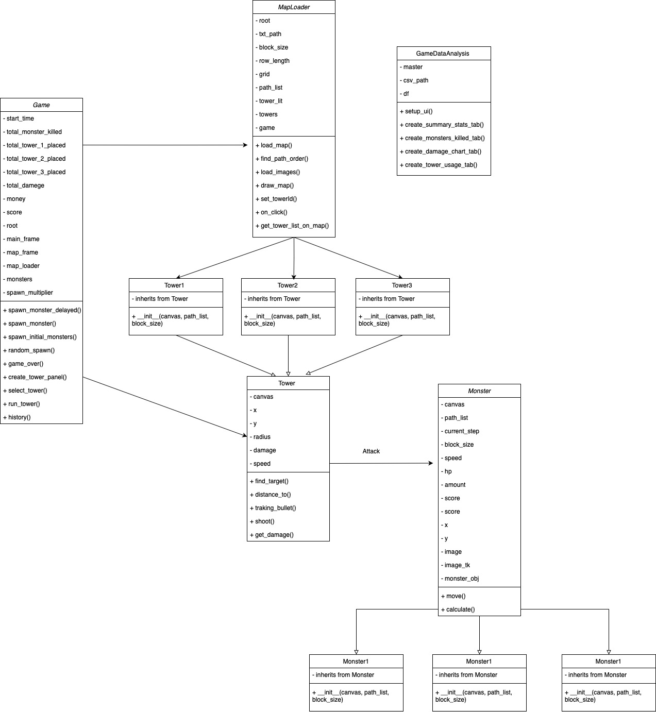

# Tower Defense

This project is a strategic tower defense game where players must defend their base by strategically placing towers to stop waves of enemies. The game includes various tower types, enemy types, and mechanics to enhance the gameplay experience.

## Game Concept

Players must defend their base by strategically placing towers to stop waves of enemies. When players defeat monsters, they earn money, which can be used to place additional towers or upgrade existing ones. The game ends only when the monsters successfully reach the final destination, and the player's score along with the time taken to play the game will be displayed.

## Python Version

Requires Python >= 3.10

## Current Features

- Multiple tower types with unique abilities and upgrade options.
- Various enemy types with different behaviors and strengths.
- A wave system that increases in difficulty as the game progresses.
- Resource management mechanics for building and upgrading towers.
- The game ends only when the enemies successfully reach the final destination.
- Map Selection: Players can choose from multiple maps to play, each offering unique layouts and challenges.

## UML Class Diagram


## How to run the application

1. Clone the repository
    ```bash
    git clone https://github.com/Skiffet/Tower-Defense.git
    ```
2. cd into the project directory
    ```bash
    cd Tower-Defense
    ```
3. Create a virtual environment by running the following command in the terminal:
    ```bash
    python -m venv venv
    ```
4. Activate the virtual environment by running the following command in the terminal:

    **MacOS or Linux:**
    ```bash
    source venv/bin/activate
    ```

    **Windows:**
    ```bash
    venv\Scripts\activate
    ```
5. Install the required packages by running the following command in the terminal:
    ```bash
    pip install -r requirements.txt
    ```
6. Run the application by executing the following command:
    ```bash
    python main_menu.py
    ```